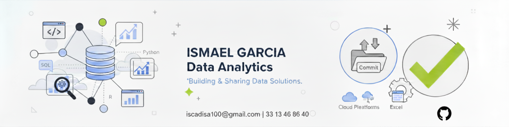

<div align="center">
  


# 👋 Hi! I'm Ismael García

### 📊 Jr Data Analyst | Transforming data into strategic decisions

[](https://www.linkedin.com/in/ismael-garcia-gomez)
[](mailto:iscadisa100@gmail.com)
[](https://wa.me/523313468640)

📍 Zapopan, Jalisco, Mexico

</div>

---

## 🚀 About Me

I'm a **Jr Data Analyst** with a background in business administration and a practical focus on **optimizing operations, after-sales service, and revenue** through intelligent data usage.

I recently graduated from the **TripleTen Bootcamp**, where I developed applied projects in:
- 🔍 Analytical diagnostics
- 🧪 A/B Testing
- 📈 Conversion funnel analysis
- 🔄 Basic ETL processes for data cleaning and visualization

> 💡 **My motivation:** Transform data into business decisions that generate tangible value, improving operational efficiency, customer experience, and profitability.

### 🎯 Industries of Interest
I'm especially interested in **fintech, retail, logistics, and finance**, where real-time analysis makes a difference. However, I remain open to other sectors with interesting analytical challenges.

---

## 🛠️ Tech Stack

<div align="center">

### Languages and Tools


### Cloud & Marketing


### Key Skills

```
📊 Data Visualization         🔄 ETL & Data Cleaning
📈 Statistical Analysis       🧪 A/B Testing
💼 Business Intelligence      🤖 Report Automation
🎯 Funnel Analysis           📉 KPIs & Business Metrics
```

</div>

---

## 🎓 Education & Experience

- 🎓 **TripleTen Bootcamp** - Data Analytics
- 💼 **Business Administration** with focus on operations and analysis
- 📊 Hands-on experience in process optimization and revenue analysis
- 🔧 Development of automated dashboards and reports

---

## 🌱 Currently

- 📚 Deepening my knowledge in advanced predictive analysis techniques
- 🤖 Exploring AI tools for insight automation
- 💡 Building data analysis projects for my portfolio
- 🔍 Looking for opportunities to add value as a Data Analyst

---

## 📫 Contact

Have an interesting project or want to collaborate? Let's talk!

- 💼 **LinkedIn:** [Ismael García Gómez](https://www.linkedin.com/in/ismael-garcia-gomez)
- 📧 **Email:** iscadisa100@gmail.com
- 📱 **WhatsApp:** +52 33 1346 8640

---

<div align="center">

### 💬 "Data tells stories, my job is to listen and turn them into action"

⭐️ If you like my work, don't forget to star my repositories!

</div>
